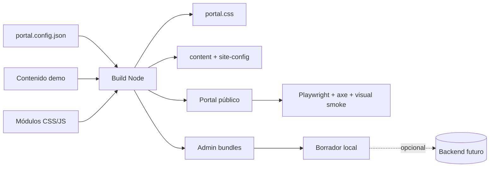

# Academic Professional Portal


**Plantilla profesional y reutilizable para perfiles académicos, docencia e investigación.** La versión 3.0 consolida la demo como un producto completo: sistema visual único en producción, navegación limpia, administración amigable y controles automáticos de calidad en navegador.

> **Demo con datos de ejemplo.** Los nombres, publicaciones, proyectos, cursos, eventos y recursos incluidos sirven para mostrar estados realistas de la plantilla. No representan un sitio institucional oficial ni una fuente académica verificada.

## Demo

- Portal público: https://prueba-pi-eight.vercel.app
- Panel de administración: https://prueba-pi-eight.vercel.app/admin

El panel trabaja sobre un borrador local y **no publica cambios**. No se simula autenticación ni persistencia que todavía no existe.

## Capacidades

| Área | Incluido |
| --- | --- |
| Perfil | Biografía, trayectoria, formación, posiciones, CV y contacto |
| Publicaciones | Búsqueda, filtros, fichas, DOI/enlaces demo y copiar referencia |
| Investigación | Líneas, proyectos, colaboración y fichas compartibles |
| Docencia | Cursos, materiales y experiencia docente |
| Difusión | Eventos, blog, galería y podcast |
| UX | Responsive, claro/oscuro, ES/EN, estados vacíos, búsqueda global y navegación limpia |
| SEO | Canonical, Open Graph, Schema.org, sitemap, RSS y detalle estático |
| Administración | Formularios humanos, borradores, preview, reordenamiento y aviso de cambios sin guardar |
| Calidad | Auditoría estructural, Playwright, axe y capturas visuales en CI |
| Seguridad | CSP, headers de Vercel, admin noindex y cero secretos de frontend |

## Qué cambió en 3.0

La producción ya no depende de una cascada de hojas visuales cargadas por separado. El build conserva módulos fuente mantenibles, pero entrega **un único `portal.css`** para el portal público y bundles consolidados para `/admin`. `portal.config.json` concentra identidad, colores, secciones y feature flags.

La PWA es ahora opcional. La demo la mantiene desactivada para priorizar actualizaciones inmediatas; si existía un Service Worker anterior, el runtime lo elimina de forma segura.

Inicio incorpora un resumen académico demostrativo, accesos rápidos y estados vacíos coherentes. Publicaciones añade una acción para copiar la referencia visible. El admin comunica claramente si hay cambios sin guardar y protege contra cierres accidentales.

## Arquitectura



```text
.
├── admin/                  # Admin fuente + capa v3
├── assets/
│   ├── css/                # Módulos fuente del sistema visual
│   └── js/                 # Router, renderers y mejoras progresivas
├── tests/                  # E2E, accesibilidad y visual smoke
├── docs/                   # Arquitectura, diseño, pruebas y personalización
├── scripts/                # Build, consolidación, servidor y auditoría
├── portal.config.json      # Branding, features y modo demo
├── playwright.config.js
├── tailwind.config.cjs
└── vercel.json
```

Durante el build, `CMS_CONTENT` se extrae a `dist/assets/data/`. **No se migra a Supabase ni a otra base de datos.**

## Inicio rápido

Node.js 24 recomendado; Node 20+ compatible.

```bash
npm install
npm run check
```

Pruebas de navegador:

```bash
npx playwright install chromium
npm run test:e2e
npm run test:visual
```

Servidor local del build, sin dependencias adicionales:

```bash
npm run build
npm run serve
```

## Configuración

`portal.config.json` permite centralizar:

- nombre, cargo e institución del perfil;
- dominio y metadata;
- colores principales;
- tema por defecto;
- secciones habilitadas;
- búsqueda, bilingüismo, PWA y otras features;
- estado demo y política de placeholders.

Consulta [`docs/CUSTOMIZATION.md`](docs/CUSTOMIZATION.md) y [`docs/DESIGN-SYSTEM.md`](docs/DESIGN-SYSTEM.md).

## Panel de administración

Ruta: `/admin`

Permite editar contenido con nombres comprensibles, trabajar con ES/EN, añadir/duplicar/eliminar/reordenar elementos, previsualizar imágenes y enlaces, guardar borradores y revisar la vista en computadora o celular.

La versión 3.0 añade un estado visible **Sin cambios / Cambios sin guardar / Borrador guardado** y una protección `beforeunload` para evitar perder trabajo accidentalmente.

**Publicación sigue desactivada** hasta que exista un backend real con autenticación y permisos.

## Calidad

Cada push y pull request ejecuta:

1. build reproducible y auditoría estructural;
2. instalación de Chromium;
3. navegación E2E sobre rutas públicas y admin;
4. pruebas WCAG con axe;
5. comprobaciones claro/oscuro y PWA;
6. capturas visuales de rutas representativas en escritorio y móvil.

Las capturas quedan como artifacts del workflow para revisión visual. Consulta [`docs/TESTING.md`](docs/TESTING.md).

## Documentación

- [`docs/ARCHITECTURE.md`](docs/ARCHITECTURE.md)
- [`docs/CUSTOMIZATION.md`](docs/CUSTOMIZATION.md)
- [`docs/DESIGN-SYSTEM.md`](docs/DESIGN-SYSTEM.md)
- [`docs/TESTING.md`](docs/TESTING.md)
- [`docs/DEMO-DATA.md`](docs/DEMO-DATA.md)
- [`docs/ROADMAP.md`](docs/ROADMAP.md)
- [`CHANGELOG.md`](CHANGELOG.md)
- [`CONTRIBUTING.md`](CONTRIBUTING.md)
- [`SECURITY.md`](SECURITY.md)

## Backend futuro

La siguiente evolución opcional puede conectar Supabase Auth + Postgres + Storage + RLS u otra solución equivalente. La UI actual no depende de esa migración y debe conservar la separación entre borrador, publicación y permisos.

---

**Versión 3.0.0 · demo profesional · datos de ejemplo · backend no migrado.**
