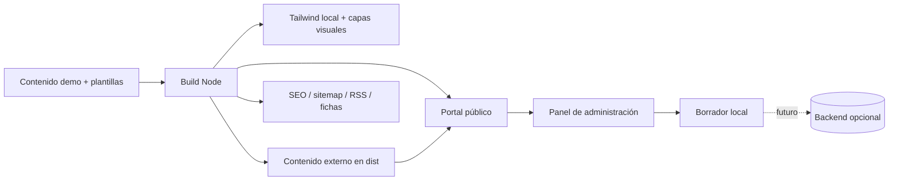

# Academic Professional Portal


**Plantilla profesional y reutilizable para portales académicos, docentes y de investigación.** Está pensada para verse como un producto terminado desde el primer clone, aunque incluya datos de demostración.

> **Demo con datos de ejemplo.** El contenido visible existe para demostrar componentes y flujos realistas. No debe interpretarse como un sitio institucional oficial ni como una fuente académica verificada.

## Demo en vivo

- Portal público: https://prueba-pi-eight.vercel.app
- Panel de administración: https://prueba-pi-eight.vercel.app/admin

La administración trabaja sobre una copia local y **no publica cambios**. Esto permite evaluar la experiencia completa sin fingir autenticación ni conectar un backend antes de tiempo.

## Lo que hace diferente a esta base

| Área | Incluido |
| --- | --- |
| Perfil académico | Trayectoria, formación, posiciones, contacto y CV |
| Producción | Publicaciones, búsqueda, filtros y fichas individuales |
| Investigación | Proyectos, líneas, colaboraciones y equipo |
| Docencia | Cursos, materiales y experiencia docente |
| Difusión | Eventos, blog, galería y podcast |
| Experiencia | Responsive, claro/oscuro, ES/EN, búsqueda global y PWA |
| SEO | Open Graph, Schema.org, sitemap, RSS y rutas compartibles |
| Administración | Formularios amigables, borradores, vista previa y revisión de contenido |
| Calidad | Build reproducible, Tailwind local, auditoría y GitHub Actions |
| Seguridad | Headers de Vercel, CSP, noindex del admin y sin secretos en frontend |

## Diseño de la demo

La demo conserva información de ejemplo suficientemente realista para mostrar la interfaz en estados completos. Los enlaces placeholder se identifican como acciones demostrativas en vez de comportarse como enlaces rotos, y las fichas generadas usan etiquetas legibles para usuarios no técnicos.

La identidad visual mantiene la combinación verde/dorado del portal académico original, con una jerarquía más editorial: sidebar de perfil, ancho de lectura controlado, tarjetas consistentes, contraste reforzado y comportamiento responsive.

## Arquitectura



```text
.
├── admin/                  # Panel de administración amigable
├── assets/
│   ├── css/                # Tailwind input + diseño público
│   └── js/                 # Router, renderers y mejoras progresivas
├── docs/                   # Arquitectura, personalización y roadmap
├── scripts/                # Build, routing, presentación y auditoría
├── portal.config.json      # Identidad y modo demo
├── tailwind.config.cjs
├── vercel.json
└── index.html
```

Durante el build, `CMS_CONTENT` se extrae a `dist/assets/data/`. **No se migra a Supabase ni a ninguna base de datos.**

## Inicio rápido

Node.js 24 es la versión recomendada; Node 20+ es compatible.

```bash
npm install
npm run check
```

Para generar únicamente producción:

```bash
npm run build
```

El resultado final se escribe en `dist/`.

## Panel de administración

Ruta: `/admin`

Permite:

- cargar una copia del contenido actual;
- editar información con etiquetas comprensibles;
- trabajar con campos bilingües ES/EN;
- añadir, duplicar, eliminar y reordenar elementos;
- ver imágenes y abrir enlaces desde el propio formulario;
- guardar borradores en el navegador;
- revisar campos pendientes, traducciones y posibles repetidos;
- previsualizar en tamaño computadora o celular;
- cargar o descargar una copia desde **Más opciones**.

**La publicación permanece desactivada** hasta conectar un sistema real de autenticación y persistencia.

## Calidad y CI

Cada push y pull request ejecuta `npm run check`. El Quality Gate comprueba, entre otros puntos:

- sintaxis JavaScript válida en el bundle y en el admin;
- Tailwind compilado localmente;
- ausencia de routers duplicados;
- contenido separado de la lógica durante build;
- archivos PWA/SEO generados;
- assets de presentación incluidos;
- panel de administración sin publicación insegura ni lenguaje técnico innecesario;
- enlaces demo tratados como acciones de demostración.

## Personalización

- [`docs/CUSTOMIZATION.md`](docs/CUSTOMIZATION.md): identidad, dominio, branding, contenido y assets.
- [`docs/DEMO-DATA.md`](docs/DEMO-DATA.md): política de datos y placeholders de demostración.
- [`docs/ARCHITECTURE.md`](docs/ARCHITECTURE.md): estructura técnica.
- [`docs/ROADMAP.md`](docs/ROADMAP.md): evolución opcional hacia persistencia real.

## Mantenimiento

- [`CHANGELOG.md`](CHANGELOG.md): cambios por versión.
- [`CONTRIBUTING.md`](CONTRIBUTING.md): guía para contribuir.
- [`SECURITY.md`](SECURITY.md): prácticas y reporte de seguridad.

Dependabot revisa dependencias de npm y GitHub Actions. El repositorio incluye plantillas para issues y pull requests para mantener contribuciones consistentes.

## Backend futuro

La interfaz está preparada para conectar posteriormente Supabase Auth + Postgres + Storage + RLS u otra solución equivalente. Esa fase es opcional y debe conservar la separación entre borradores, contenido publicado y permisos.

---

**Versión 2.2.0 · demo profesional · datos de ejemplo · sin migración de backend.**
